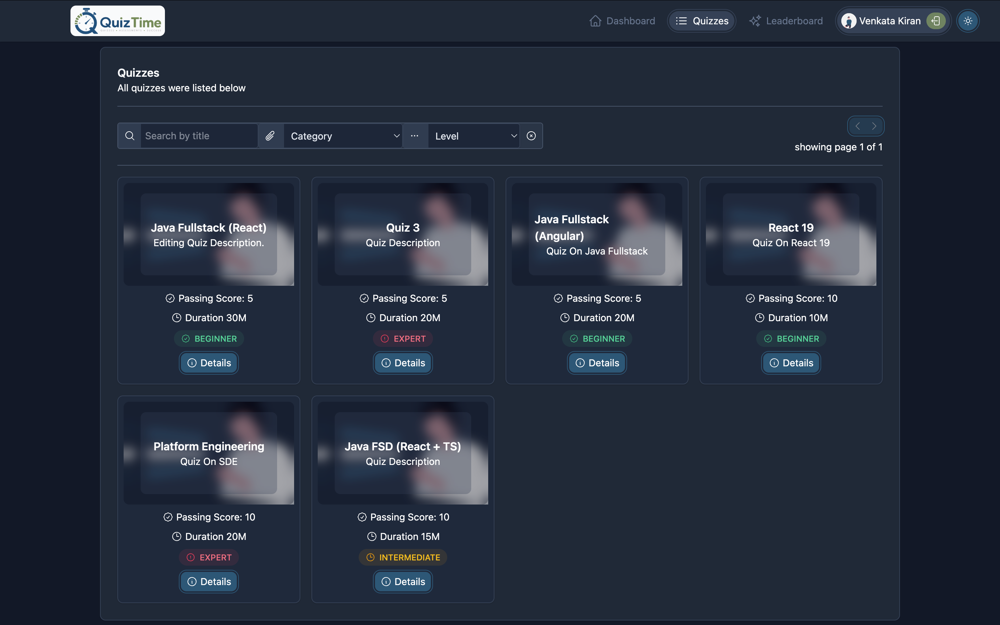
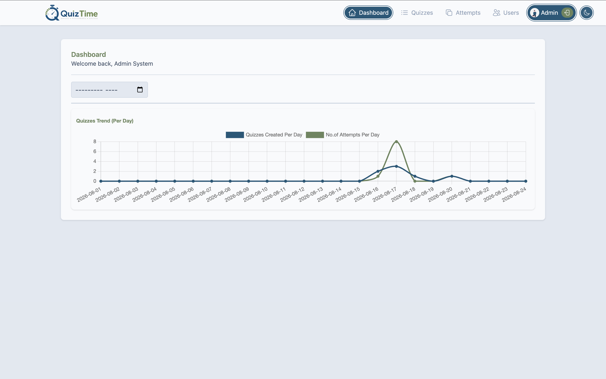
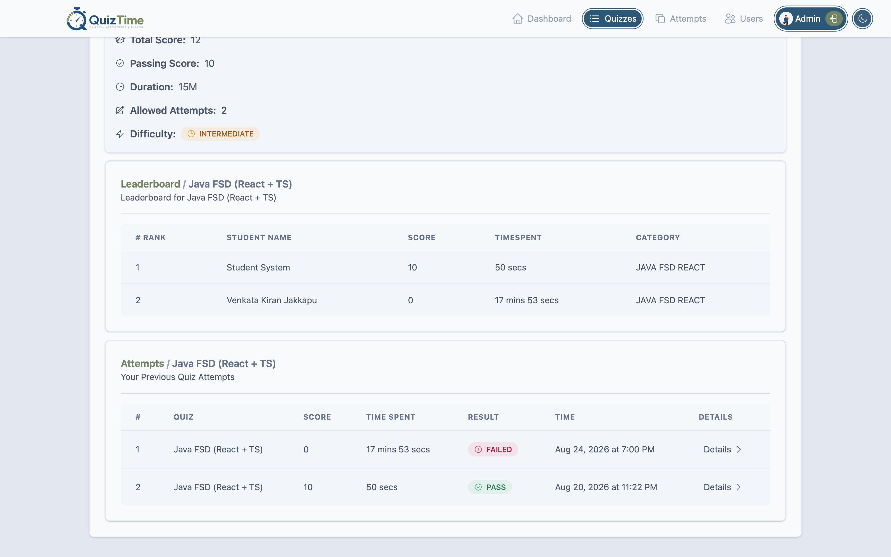
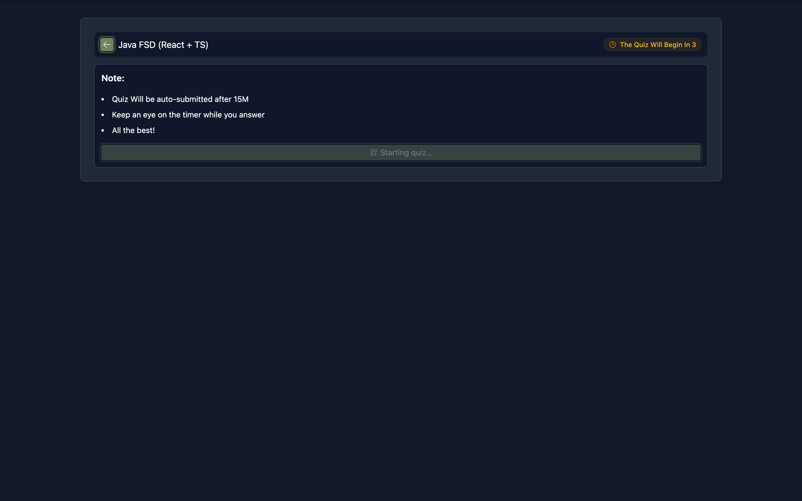
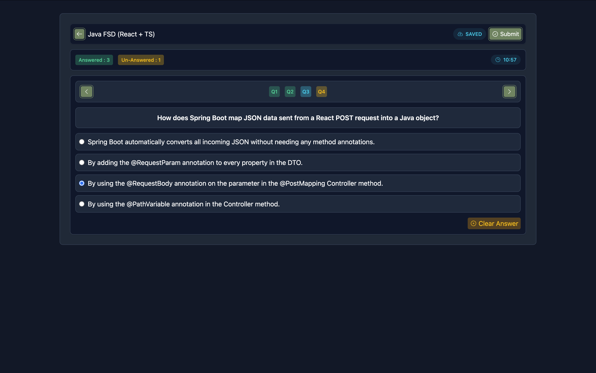
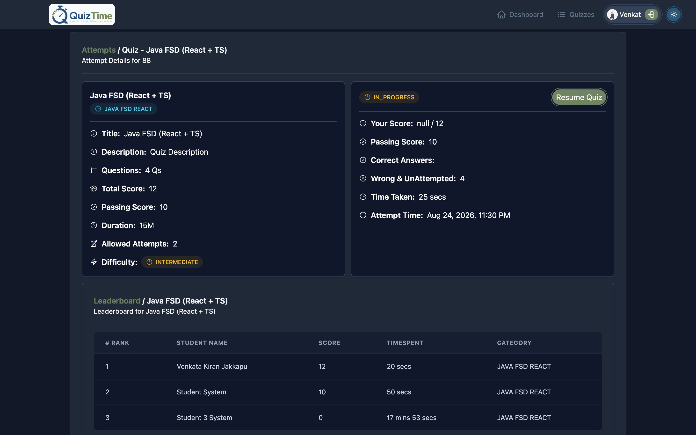
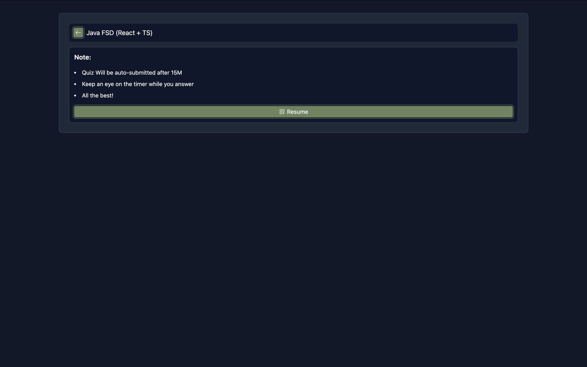
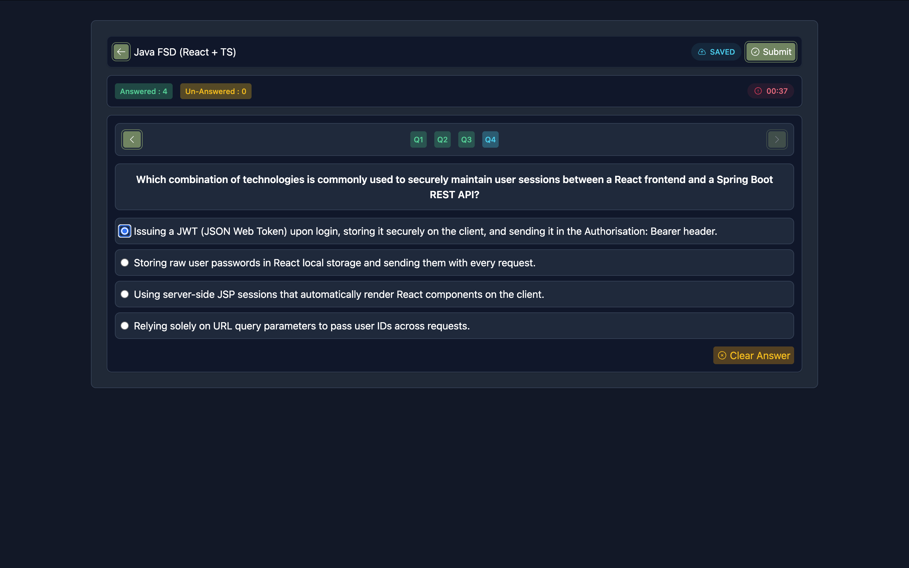
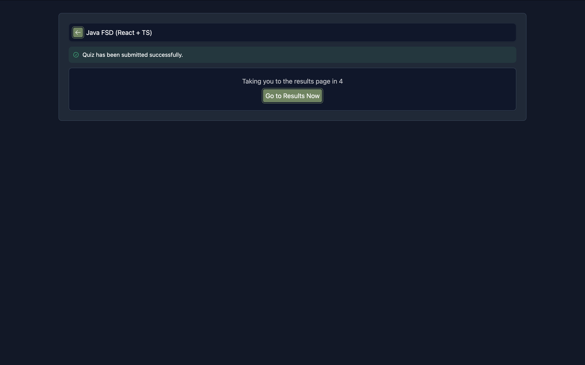
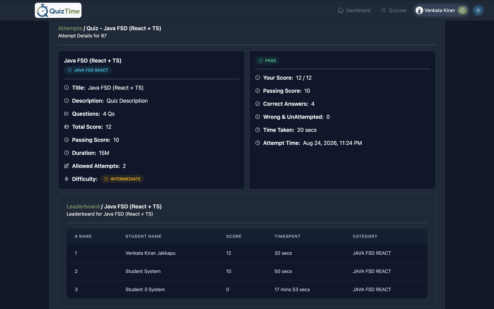

# Quiz & Online Assessments Portal (QOAP)

> A cloud-native microservices-based Quiz and Online Assessments Portal built with Spring Boot, Spring Cloud, React, and reusable platform architecture.


---

## Overview

The **Quiz & Online Assessments Portal (QOAP)** is a cloud-native application designed to support the creation, management, delivery, and evaluation of online quizzes and assessments.

The system follows a microservices architecture where authentication, quiz management, and reporting capabilities are separated into independently deployable services.

The project also introduces a reusable **Labmantix Platform** containing common infrastructure capabilities such as security, centralized exception handling, logging, request-context propagation, and HTTP client configuration.

The application supports two primary roles:

* **Administrators** — manage users, quizzes, questions, options, quiz status, and assessment data.
* **Students** — browse available quizzes, attempt assessments, submit answers, view attempt information, and access leaderboards.

The system demonstrates modern enterprise software engineering practices including:

* Microservices architecture
* Domain-oriented service decomposition
* JWT-based authentication and authorization
* Role-based access control
* Centralized configuration management
* Service discovery
* API Gateway routing
* Reusable Spring Boot platform starters
* Request correlation and centralized logging
* Inter-service communication
* RESTful API design
* Automated request-context and bearer-token propagation
* Database per service
* React-based SPA architecture

---

# Features

### Backend

* User registration and management
* JWT authentication
* Access and refresh token management
* Role-based authorization
* Quiz creation and management
* Quiz status management
* Question and option management
* Quiz categories
* Timed quiz attempts
* Answer submission
* Automatic quiz completion when time expires
* Student attempt history
* Quiz leaderboards
* Quiz trend reports
* Centralized configuration
* Service discovery
* API Gateway routing
* Centralized request and exception logging
* Standardized API error responses
* Inter-service authentication propagation
* OpenAPI / Swagger documentation

### Frontend

* React-based single-page application
* TypeScript
* Role-based UI
* Protected routes
* User authentication
* User profile management
* Quiz browsing
* Quiz administration
* Timed quiz attempts
* Attempt tracking
* Leaderboards
* Quiz reports and dashboards
* User management
* Reusable form and UI components
* REST API integration through Axios
* JWT handling and request/response interceptors

---

# Architecture

The application follows a **microservices architecture** where business capabilities are separated into independently deployable services.

```text
                         +--------------------------------+
                         |            Client              |
                         |       React + TypeScript       |
                         +---------------+----------------+
                                         |
                                         |
                                 +-------v--------+
                                 |   API Gateway  |
                                 +-------+--------+
                                         |
                     +-------------------+-------------------+
                     |                   |                   |
              +------v------+     +------v------+     +------v------+
              |  Identity   |     |    Quiz     |     |   Reports   |
              |   Service   |     |   Service   |     |   Service   |
              +------+------+     +------+------+     +------+------+
                     |                   |                   |
              +------v------+      +------v------+           |
              | PostgreSQL |      | PostgreSQL  |            |
              |  Identity  |      |    Quiz     |            |
              +-------------+      +-------------+           |
                                                             |
                                         +-------------------+
                                         |
                                  Inter-Service Calls
                                         |
                                  +------v------+
                                  |   Identity  |
                                  |    / Quiz   |
                                  +-------------+
```

### Cloud Infrastructure

```text
                         +----------------------+
                         |     Config Server    |
                         +----------+-----------+
                                    |
                                    | Configuration
                                    |
             +--------------------+--------------------+
             |                    |                    |
      +------v------+      +------v------+      +------v------+
      | API Gateway |      |  Identity   |      |    Quiz     |
      |             |      |   Service   |      |   Service   |
      +------+------+      +------+------+      +------+------+
             |                    |                    |
             +--------------------+--------------------+
                                  |
                         +--------v---------+
                         | Eureka Registry  |
                         +------------------+
```

The services use **Eureka** for service discovery and the **API Gateway** routes external requests to the appropriate service using service discovery.

---

# Shared Platform

The application includes a reusable **Labmantix Platform** that provides infrastructure capabilities shared by the business services.

```text
Labmantix Platform
│
├── Web
│   └── Standardized HTTP Error Handling
│
├── Logging
│   ├── Request Context
│   ├── Correlation IDs
│   ├── Request Logging
│   ├── Response Logging
│   └── Exception Logging
│
├── Security
│   ├── JWT Resource Server
│   ├── Authentication Context
│   ├── Role-Based Authorization
│   └── Authenticated User Abstraction
│
└── RestClient
    ├── Request Context Propagation
    └── Bearer Token Propagation
```

The platform allows individual services to focus on business logic while providing common infrastructure through Spring Boot auto-configuration.

### Web Module

Provides:

* Standardized error responses
* Framework exception handling
* Bean validation error mapping
* Extensible error definitions
* Centralized HTTP error handling

### Logging Module

Provides:

* Request context management
* Correlation ID generation
* Request logging
* Response logging
* Exception logging
* Rolling file logging
* Logback configuration

Requests can be associated with a correlation identifier using:

```text
X-Correlation-Id
```

### Security Module

Provides:

* JWT resource-server integration
* Stateless authentication
* Method-level authorization
* Authentication context abstraction
* Authenticated user abstraction
* Configurable JWT claim mapping
* Authentication and authorization error handling
* CORS configuration

### RestClient Module

Provides standardized propagation of:

* Request-context headers
* Correlation IDs
* Bearer authentication tokens

This allows authenticated downstream requests to retain the necessary security and request context.

---

# Services

## Identity Service

The Identity Service is responsible for authentication, authorization, and user management.

### Responsibilities

* User creation
* User retrieval
* User updates
* Password changes
* User deletion
* Role management
* Login
* Logout
* Access-token generation
* Refresh-token management
* JWT validation
* User lookup by IDs

### Authentication Flow

```text
Client
   |
   | Login Credentials
   v
Identity Service
   |
   | Validate Credentials
   v
User Repository
   |
   | Valid
   v
JWT Access Token
+
Refresh Token
   |
   v
Client
```

The service uses JWT-based stateless authentication while maintaining refresh tokens for access-token renewal.

---

## Quiz Service

The Quiz Service contains the core assessment domain.

### Responsibilities

* Quiz creation
* Quiz modification
* Quiz deletion
* Quiz status management
* Question management
* Option management
* Quiz categories
* Quiz settings
* Student quiz attempts
* Answer submission
* Attempt tracking
* Automatic attempt completion

### Quiz Structure

```text
Quiz
│
├── Quiz Settings
│
├── Category
│
└── Questions
      │
      └── Options
```

### Assessment Flow

```text
Student
   |
   v
Select Quiz
   |
   v
Begin Attempt
   |
   v
Answer Questions
   |
   +---- Save Answers ----+
   |                      |
   v                      |
Timer Running             |
   |                      |
   +----------+-----------+
              |
        Time Expires
              |
              v
      Auto Complete Attempt
              |
              v
       Persist Attempt
```

The Quiz Service differentiates between administrative and student-facing responses so that administrative users can access management information while students receive the appropriate assessment representation.

---

## Reports Service

The Reports Service provides reporting and analytical functionality derived from quiz and attempt information.

### Responsibilities

* Quiz trend reports
* Monthly quiz reports
* Quiz leaderboards
* Aggregated assessment information

### Reporting Capabilities

```text
Reports
│
├── Quiz Trends
│   ├── Current Month
│   └── Specific Month
│
└── Leaderboards
    └── Quiz-specific Rankings
```

The Reports Service communicates with other services when additional quiz or user information is required.

---

# API Gateway

The API Gateway provides the external entry point into the backend services.

Routes are configured using Spring Cloud Gateway and Eureka service discovery.

```text
/identity/**  →  lb://qoap-identity-service

/quiz/**      →  lb://qoap-quiz-service

/reports/**   →  lb://qoap-reports-service
```

The `lb://` routes allow requests to be resolved through the Eureka service registry rather than relying on fixed service addresses.

---

# Config Server

The Config Server provides centralized configuration for the distributed services.

Configuration is maintained separately from individual services and includes:

* Database configuration
* Eureka configuration
* Service URLs
* Security configuration
* Logging configuration
* RestClient configuration
* API Gateway routes

Example configuration structure:

```text
cloud/repo/
│
├── application.yml
├── qoap-api-gateway.yml
├── qoap-identity-service.yml
├── qoap-quiz-service.yml
└── qoap-reports-service.yml
```

This allows common configuration to be shared while service-specific configuration remains isolated.

---

# Service Registry

The application uses **Netflix Eureka** as its service registry.

Services register themselves with Eureka and use the registry for service discovery.

```text
                    +------------------+
                    | Eureka Registry  |
                    +--------+---------+
                             |
              +--------------+--------------+
              |              |              |
              v              v              v
         Identity         Quiz          Reports
         Service         Service        Service
```

The API Gateway uses the registered service names to locate service instances dynamically.

---

# Frontend Architecture

The frontend is implemented as a React single-page application using TypeScript and Vite.

```text
React Application
│
├── Context
│   ├── Authentication
│   └── Profile
│
├── Routes
│   ├── Landing
│   ├── Dashboard
│   ├── Profile
│   ├── Quizzes
│   ├── Attempts
│   ├── Leaderboard
│   └── Users
│
├── Services
│   ├── Authentication
│   ├── Account
│   ├── Quiz
│   ├── Attempt
│   ├── Leaderboard
│   └── Reports
│
├── API
│   ├── Axios Client
│   ├── Request Interceptor
│   └── Response Interceptor
│
└── Components
    ├── Forms
    ├── Quiz Components
    ├── Layouts
    ├── Pagination
    └── UI Components
```

### Route Protection

The frontend separates public, authenticated, and administrative areas.

```text
Landing Page
     |
     +---- Public

Authenticated Layout
     |
     ├── Dashboard
     ├── Profile
     ├── Quizzes
     ├── Attempts
     └── Leaderboard

Admin Layout
     |
     └── User Management
```

---

# Technology Stack

| Layer             | Technology                  |
| ----------------- | --------------------------- |
| Backend           | Java 25, Spring Boot 4.1.0  |
| Cloud             | Spring Cloud 2025.1.2       |
| Security          | Spring Security, JWT        |
| Service Discovery | Netflix Eureka              |
| Configuration     | Spring Cloud Config         |
| Gateway           | Spring Cloud Gateway        |
| API Documentation | Springdoc OpenAPI           |
| Database          | PostgreSQL                  |
| ORM               | Spring Data JPA / Hibernate |
| HTTP Client       | Spring RestClient           |
| Frontend          | React 19.2.8                |
| Language          | TypeScript 6.0.2            |
| Frontend Build    | Vite 8.2.0                  |
| Routing           | React Router 7              |
| HTTP Client       | Axios                       |
| Styling           | Tailwind CSS 4.3.3          |
| Charts            | Chart.js, react-chartjs-2   |
| Build             | Maven, npm                  |
| Containerization  | Docker Compose              |

---

# Project Structure

The project is organized as a multi-module Maven monorepo separating reusable platform components, business services, cloud infrastructure, and the frontend application.

```text
Quiz & Online Assessments Portal
│
├── platform
│   ├── web
│   ├── logging
│   ├── security
│   └── restclient
│
├── services
│   ├── identity
│   ├── quiz
│   └── reports
│
├── cloud
│   ├── configserver
│   ├── eurekaserver
│   ├── apigateway
│   └── repo
│
├── docker
│   └── postgres
│
└── ui
    ├── components
    ├── context
    ├── layouts
    ├── pages
    ├── routes
    ├── services
    └── api
```

### Maven Reactor

```text
Quiz & Online Assessments Portal
│
├── Platform
│   ├── Web
│   ├── Logging
│   ├── Security
│   └── RestClient
│
├── Services
│   ├── Identity Service
│   ├── Quiz Service
│   └── Reports Service
│
└── Cloud Management
    ├── Config Server
    ├── API Gateway
    └── Eureka Service Registry
```

The root Maven project provides common dependency and plugin management for the modules.

```text
QOAP Parent
│
├── Dependency Management
├── Spring Cloud BOM
├── Platform Dependency Management
├── Compiler Configuration
├── Spring Boot Plugin Management
└── Child Modules
```

---

# Database Architecture

The business services use PostgreSQL with service-specific databases.

```text
PostgreSQL
│
├── qoap_identity
│   └── Identity Service
│
└── qoap_quiz
    └── Quiz Service
```

The Reports Service obtains the information it requires through service communication rather than maintaining an independent domain database in the current implementation.

PostgreSQL can be started locally using Docker Compose.

```text
docker/
└── postgres/
    └── compose.yml
```

The Compose configuration also provides **pgAdmin** for database administration.

---

# Security Architecture

The application uses JWT-based stateless authentication.

```text
             Login
               |
               v
        Identity Service
               |
        Authenticate User
               |
               v
        Access + Refresh
             Tokens
               |
               v
             Client
               |
               | Bearer Token
               v
          API Gateway
               |
               v
        Business Service
               |
               v
       JWT Resource Server
               |
               v
      Authentication Context
```

Roles are represented through JWT authorities and are used for method-level authorization.

Examples include:

```java
@PreAuthorize("hasRole('ADMIN')")
```

and:

```java
@PreAuthorize("hasAnyRole('ADMIN','STUDENT')")
```

---

# Inter-Service Communication

Business services communicate through HTTP APIs using the shared RestClient platform module.

The request context and authentication token can be propagated automatically.

```text
Incoming Request
      |
      v
Request Context
      |
      +---- Correlation ID
      |
      +---- Authentication Token
      |
      v
Business Service
      |
      | RestClient
      v
Downstream Service
      |
      +---- X-Correlation-Id
      |
      +---- Authorization: Bearer <token>
```

This maintains request traceability and authentication across service boundaries.

---

# Observability

The shared Logging module provides centralized operational logging across services.

The logging infrastructure supports:

* Request logging
* Response logging
* Exception logging
* Correlation IDs
* Rolling log files
* Request context propagation

Example:

```text
REQ GET /quiz/api/v1/123
    |
    | correlationId
    v
Quiz Service
    |
    v
Reports Service
    |
    v
RES GET /reports/api/v1/quiz/monthly
```

The correlation identifier allows related requests across services to be associated with the same originating operation.

---

# API Documentation

The backend services integrate **Springdoc OpenAPI** for API documentation.

The services expose OpenAPI metadata and Swagger UI endpoints for interactive API exploration.

Security-protected APIs use bearer-token authentication through the configured OpenAPI security scheme.

---

# Design Principles

The system is built around the following principles:

* Microservices Architecture
* Separation of Concerns
* Single Responsibility Principle
* Database per Service
* Loose Coupling
* High Cohesion
* Independent Deployment
* Stateless Authentication
* Role-Based Authorization
* Centralized Configuration
* Service Discovery
* API Gateway Pattern
* Reusable Platform Libraries
* Infrastructure and Business Logic Separation
* Request Context Propagation
* Centralized Logging
* Constructor Injection
* Spring Boot Auto-Configuration

---

# Running the Project

## Prerequisites

* Java 25+
* Maven
* Node.js and npm
* PostgreSQL or Docker
* Docker Compose (recommended)

## Start PostgreSQL

From the project root:

```bash
docker compose -f docker/postgres/compose.yml up -d
```

This starts:

* PostgreSQL
* pgAdmin

## Startup Order

The recommended startup sequence is:

1. PostgreSQL
2. Config Server
3. Eureka Service Registry
4. API Gateway
5. Identity Service
6. Quiz Service
7. Reports Service
8. React UI

The Config Server should be available before the services that consume centralized configuration.

The Eureka Service Registry should be available before services register themselves and before the API Gateway attempts service discovery.

## Start the Frontend

```bash
cd ui
npm install
npm run dev
```

The frontend is configured as a Vite development application.

# Screenshots

## Quizzes



## Dashboard



## Quiz Details



## Begin



## Portal



## Interrputed Quiz



## Resume



## Lastmin



## Submission



## Leaderboard/Results



---

# Future Enhancements

Potential future improvements include:

* Event-driven communication
* Distributed tracing
* Centralized monitoring
* Docker containerization for all services
* Kubernetes deployment
* CI/CD pipeline
* Notification service
* More advanced assessment analytics
* Persistent report storage
* Scalable object/file storage for assessment resources
* Automated integration testing across services

---

# License

This project is developed for educational and learning purposes as part of an internship project.

# Author

Developed as part of an internship project to demonstrate enterprise application development using Spring Boot, Spring Cloud, React, and microservices architecture.

**Venkata Kiran J** - [Connect with me on LinkedIn](https://www.linkedin.com/in/venkata-kiran-jakkapu-a2209415a/)
